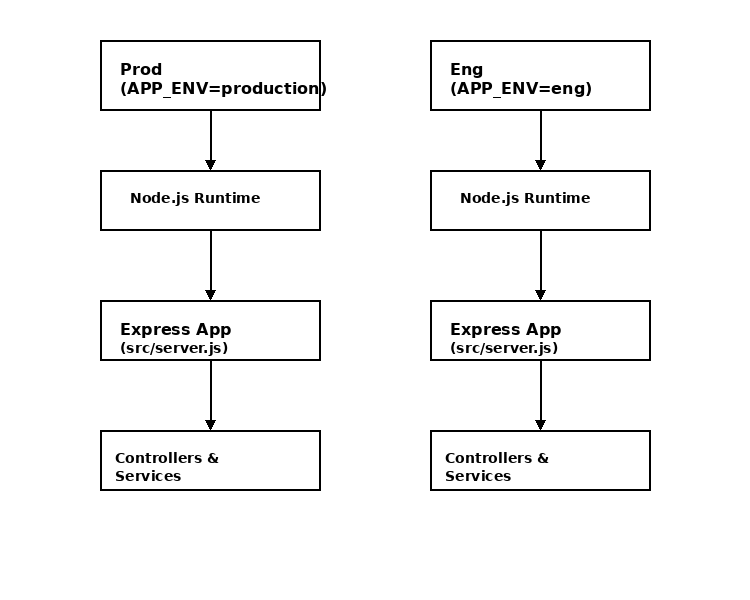

# NodeJS Backend


A backend service built with [NestJS](https://nestjs.com/) and [Nx](https://nx.dev/), using the [Fastify](https://fastify.dev/) adapter for high performance.  
This project provides modular architecture, validation, logging, and OpenAPI documentation.

---

## 📑 Table of Contents

- [Overview](#overview)
- [Tech Stack](#tech-stack)
- [Getting Started](#getting-started)
  - [Prerequisites](#prerequisites)
  - [Installation](#installation)
  - [Running the App](#running-the-app)
- [Scripts](#scripts)
- [Testing](#testing)
- [API Documentation](#api-documentation)
- [Nx Intro](#why-nx)
- [Environments](#render-deployment)
- [Render Deployment Workflow](#render-deployment-workflow)
  - [Steps to Deploy](#steps-to-deploy)
- [Architecture](#architecture)
- [Contributing](#contributing)

---

## 📌 Overview

This repository contains the **NodeJS backend** built using **NestJS + Nx + Fastify**.  
It is structured to support multiple environments (Eng, Test, Prod) and includes built-in support for:

- DTO validation with `class-validator`
- Logging service
- Custom validators
- API documentation via Swagger / OpenAPI
- Deployments on [Render](https://render.com)

---

## ⚙️ Tech Stack

- **Language**: TypeScript
- **Framework**: [NestJS 11](https://docs.nestjs.com/)
- **HTTP Adapter**: [Fastify](https://fastify.dev/)
- **Tooling**: [Nx](https://nx.dev/)
- **Validation**: [class-validator](https://github.com/typestack/class-validator)
- **API Docs**: [Swagger / OpenAPI](https://swagger.io/)
- **Deployment**: [Render](https://render.com)

---

## 🚀 Getting Started

### Prerequisites

- [Node.js v20](https://nodejs.org/)
- [npm](https://www.npmjs.com/) v9+

### Installation

Clone the repo and install dependencies:

```bash
git clone <repo-url>
cd nodejs-backend
npm install
```

### Running the App

Start the application in **development**:

```bash
npm run start
```

---

## 📜 Scripts

| Command                 | Description                                      |
|-------------------------|--------------------------------------------------|
| `npm run start`         | Start in development mode                        |
| `npm run start:eng`     | Start in Eng environment                         |
| `npm run start:test`    | Start in Test environment                        |
| `npm run start:prod`    | Start in Production environment                  |
| `npm run build:eng`     | Build for Eng                                    |
| `npm run build:test`    | Build for Test                                   |
| `npm run build:prod`    | Build for Prod                                   |
| `npm run lint`          | Run ESLint checks                                |
| `npm run test`          | Run unit tests                                   |
| `npm run test:coverage` | Run tests with coverage                          |
| `npm run document:write`| Generate OpenAPI spec (`collections/api-spec.yaml`) |

---

## 🧪 Testing

Run unit tests:

```bash
npm run test
```

Run with coverage:

```bash
npm run test:coverage
```

Run & Watch unit tests:

```bash
npm run test:watch
```

---

## 📖 API Documentation

- OpenAPI spec is generated into:  
  `collections/api-spec.yaml` (Swagger + Bruno)  
  `collections/postman_collection.json` (Postman)

- Swagger UI is available when the app is running at:  

  ```url
  http://localhost:3000/swagger
  ```

---

## Why Nx?

- Consistent task running across environments
- Smart caching (local + Nx Cloud) → faster CI/CD
- Scales well for monorepos with multiple Node.js apps

---

## Render Deployment

This application is deployed on Render with the following environments:

| Environment | URL                                        | APP_ENV    |
| ----------- | ------------------------------------------ | ---------- |
| Production  | <https://nodejs-backend-prod.onrender.com> | production |
| Engineering | <https://nodejs-backend-eng.onrender.com>  | eng        |

> Each service runs the same codebase with different `APP_ENV` values.

---

## Render Deployment Workflow

This project is deployed to **Render** using:

- **render.yaml** → Defines multiple Render services (prod, eng) with their own `APP_ENV`
- **Environment Variables** → Secrets (`DATABASE_URL`, `JWT_SECRET`, etc.) must be set in Render’s dashboard or in `render.yaml` (`sync: false`)

### Steps to deploy

1. Commit and push changes to GitHub branch.
2. Render detects the `render.yaml` blueprint from master branch and provisions services.
3. Each service runs with its own environment (`APP_ENV=production`, `APP_ENV=eng`)
4. Access environments via their respective URLs.

---

## Architecture



## 🤝 Contributing

- Do not commit directly to `master`.  
- Create custom branches and raise Pull Requests.  
- Ensure build, tests and lint pass before merging.

---
